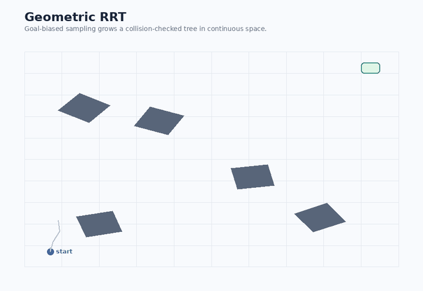
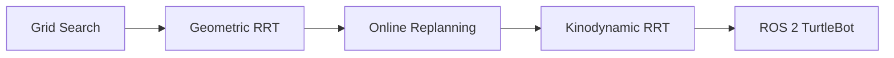

# Robot Motion Planning

A compact robotics planning project covering **graph search, geometric RRT, kinodynamic RRT, online replanning, and ROS 2 TurtleBot integration**.

The project started as coursework in *Sensing, Planning, and Control in Robotics* at Washington University in St. Louis and was reorganized here as a focused motion-planning portfolio project.

## Demo



The animation is generated from the same collision checking, steering, obstacle model, and planning assumptions used by the repository. It first grows a geometric RRT, then reveals an obstacle on the planned route and replans against the updated map.

## What is implemented

- **Grid-based shortest-path planning** with obstacle-aware discretization
- **Geometric RRT** for a disk robot among rotated obstacles
- **Online RRT replanning** with a partially observed occupancy map
- **Kinodynamic RRT** for differential-drive dynamics with a finite control set
- **ROS 2 TurtleBot planner node** using odometry, occupancy-grid mapping, and waypoint goals

## Planning progression



The progression is intentional: start with discrete graph search, move to sampling-based planning in continuous space, add partial observability and replanning, then enforce differential-drive motion constraints and connect the planner to a robot stack.

## Repository structure

```text
.
├── planners/
│   ├── grid_search.py
│   ├── geometric_rrt.py
│   ├── online_replanning.py
│   └── kinodynamic_rrt.py
├── ros2/
│   └── turtlebot_rrt_planner.py
├── tests/
│   └── test_planners.py
├── docs/
│   └── design-notes.md
├── scripts/
│   └── generate_rrt_demo.py
├── .github/workflows/ci.yml
├── requirements.txt
└── README.md
```

## 1. Grid search

`planners/grid_search.py` implements a label-correcting shortest-path method on an occupancy grid.

The original grid experiment modeled a disk robot moving through a cluttered 10 x 10 workspace. This deterministic baseline establishes the graph-search formulation before moving to continuous planning.

## 2. Geometric RRT

`planners/geometric_rrt.py` implements Rapidly-exploring Random Trees in continuous 2-D space.

Key pieces:

- goal-biased sampling;
- nearest-neighbor selection;
- fixed-step steering;
- collision checking along edges;
- disk-robot collision margins;
- parent-based path reconstruction.

The original experiments used a 10 x 10 environment with rotated square obstacles and a disk robot of radius 0.5 m.

## 3. Online replanning

`planners/online_replanning.py` extends the geometric planner to a partially observed occupancy map.

Unknown cells are treated optimistically as traversable. As sensing reveals occupied cells, the map is updated and the path can be validated and replanned.

```text
plan -> move -> sense -> update map -> validate path -> replan if needed
```

## 4. Kinodynamic RRT

`planners/kinodynamic_rrt.py` plans in `(x, y, theta)` using differential-drive dynamics.

Instead of steering directly toward a sample, it:

1. samples a target state;
2. finds the nearest tree state;
3. propagates a finite set of `(v, omega)` controls;
4. chooses the rollout ending closest to the sample;
5. collision-checks the propagated trajectory;
6. stores the feasible state and the applied control.

The project used TurtleBot-like limits of approximately **0.25 m/s** linear velocity and **1.82 rad/s** angular velocity.

## 5. ROS 2 TurtleBot integration

`ros2/turtlebot_rrt_planner.py` adapts RRT to a TurtleBot-style ROS 2 stack.

The node:

- subscribes to `/odom`;
- subscribes to `/map` as an `OccupancyGrid`;
- converts occupied cells to world coordinates;
- plans RRT paths against the current map;
- validates the remaining path;
- replans when newly mapped obstacles invalidate it;
- publishes waypoint goals to `/goal_pose`.

Robot bring-up, SLAM, and Nav2 launching are intentionally kept outside the planner node instead of being hard-coded to specific machines or IP addresses.

## Quick start

For the standalone planners:

```bash
python -m venv .venv
source .venv/bin/activate
pip install -r requirements.txt

python planners/grid_search.py
python planners/geometric_rrt.py
python planners/online_replanning.py
python planners/kinodynamic_rrt.py
```

Run tests:

```bash
pytest
```

ROS 2 dependencies are not installed through `requirements.txt`; run the TurtleBot node inside an existing ROS 2 environment.

## Design choices

**Robot footprint.** Collision checking treats the robot as a disk, so obstacle checks include robot radius rather than treating the robot as a point.

**Edge validation.** RRT edges are sampled at intermediate points. This avoids accepting an edge whose endpoints are safe but whose interior crosses an obstacle.

**Goal bias.** The RRT variants occasionally sample the goal region to improve convergence while preserving exploration.

**Unknown space.** The online planner uses an optimistic assumption for unknown cells, then replans when sensing reveals a conflict. This is deliberately simple and is not a belief-space planner.

## Course context

The original assignments asked for planning in cluttered environments with a TurtleBot 3 Waffle Pi, including geometric and kinodynamic RRT, replanning in unknown environments, Gazebo validation, and a real-robot demonstration. The code here has been renamed and reorganized around the underlying planning ideas rather than assignment numbers.

## Limitations

- nearest-neighbor lookup is linear in the number of RRT nodes;
- collision checking is sampling-based rather than exact continuous collision detection;
- the online planner uses a simple optimistic unknown-space policy;
- the ROS 2 integration publishes waypoint goals rather than replacing the lower-level navigation controller;
- this is a research/course project, not a production navigation stack.

## Future work

This project also motivates my current research interest in using nonlinear minimum-energy steering as a local steering primitive inside sampling-based planners such as RRT*.
