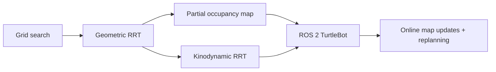

# Robot Motion Planning

A compact robotics planning codebase spanning **grid search, geometric RRT, kinodynamic RRT, partial-map planning, and ROS 2 TurtleBot navigation**.

The project grew from a sequence of planning and control assignments into a final TurtleBot navigation prototype. This repository reorganizes that work around the algorithms themselves rather than course/homework file names.

## What is implemented

| Planner | State | Environment knowledge | Main idea |
| --- | --- | --- | --- |
| Label-correcting search | grid cell | known occupancy grid | shortest path on a 4-connected graph |
| Geometric RRT | `(x, y)` | known obstacles | sample, nearest, steer, edge collision check |
| Optimistic partial-map RRT | `(x, y)` | partially observed | unknown cells treated as free until sensed |
| Kinodynamic RRT | `(x, y, theta)` | known obstacles | choose from finite differential-drive controls |
| ROS 2 TurtleBot RRT | `(x, y)` + live map | online occupancy grid | plan, publish waypoints, revalidate, replan |

## Planning progression



The final robotics setup uses a TurtleBot3 Waffle Pi operating in an initially unknown, obstacle-cluttered environment. The planner consumes mapping updates, treats unknown space optimistically, and replans when newly observed occupied cells invalidate the remaining route.

## Representative demos

### Geometric RRT


A goal-biased RRT expands in continuous 2D space and collision-checks candidate edges against rotated obstacles while accounting for the robot radius.

### Kinodynamic RRT


The kinodynamic variant plans in `(x, y, theta)` and expands the tree using short differential-drive control primitives `(v, omega)` rather than straight-line steering.

### Grid planning


The discrete baseline uses label correction on a 4-connected occupancy grid, illustrating the resolution-vs-computation trade-off that motivates continuous sampling-based planning.

## Repository structure

```text
.
├── src/robot_motion_planning/
│   ├── environment.py          geometry and collision checking
│   ├── grid_search.py          label-correcting shortest path
│   ├── geometric_rrt.py        reusable geometric RRT core
│   ├── kinodynamic_rrt.py      differential-drive RRT
│   ├── partial_map.py          optimistic occupancy representation
│   └── visualization.py
├── examples/
│   ├── grid_search_demo.py
│   ├── geometric_rrt_demo.py
│   ├── kinodynamic_rrt_demo.py
│   └── partial_map_rrt_demo.py
├── ros2/
│   └── turtlebot_rrt_node.py   occupancy-grid planning + replanning
├── tests/
├── docs/
└── assets/
```

## Quick start

```bash
python -m venv .venv
source .venv/bin/activate
pip install -e ".[dev]"
```

Run the algorithm demos:

```bash
python examples/grid_search_demo.py
python examples/geometric_rrt_demo.py
python examples/kinodynamic_rrt_demo.py
python examples/partial_map_rrt_demo.py
```

Run tests:

```bash
pytest -q
```

## ROS 2 TurtleBot node

`ros2/turtlebot_rrt_node.py` is the cleaned version of the final robot prototype. It:

- subscribes to `/odom` and `/map`;
- inflates occupied cells by the robot radius;
- plans through unknown cells optimistically;
- publishes intermediate waypoints to `/goal_pose`;
- rechecks the remaining route after map updates;
- replans from the current position when the route becomes invalid.

Example after installing the core package in a ROS 2 environment:

```bash
python ros2/turtlebot_rrt_node.py --ros-args \
  -p goal_x:=2.0 \
  -p goal_y:=2.0
```

The public version intentionally removes lab-machine IP addresses and startup assumptions from the original prototype. Robot bring-up, SLAM, and Nav2 should be launched through the user's ROS 2 environment.

## Design notes

### Geometric collision checking

The static examples use five rotated square obstacles. Candidate edges are sampled along the segment, and each point is checked against the obstacle geometry after inflating for a disk-shaped robot.

### Kinodynamic steering

For each random state sample, the planner evaluates a finite set of controls bounded by the TurtleBot differential-drive limits used in the original project. Each control is propagated for a short horizon, and the reachable state closest to the sample is selected before collision checking.

### Unknown environments

The partial-map representation uses three states:

- `-1`: unknown
- `0`: observed free
- `1`: observed occupied

Planning is optimistic over unknown space. In a live system, new sensing can invalidate a planned segment; the ROS 2 node detects that condition and triggers a new RRT.

## Project context

This work was developed in **ESE 4450: Sensing, Planning, and Control in Robotics** at Washington University in St. Louis. The original project progressed from discrete planning and continuous RRT to kinodynamic planning and a TurtleBot3 implementation in an unknown environment.

The repository is a cleaned technical portfolio version: assignment filenames, duplicated plotting code, machine-specific configuration, and lab-network details have been removed while preserving the planning methods and robot integration.

## Limitations

- RRT is probabilistically complete but not optimal; this implementation is not RRT*.
- The synthetic partial-map demo is intentionally simple and is not a full SLAM simulator.
- The ROS 2 node assumes an external mapping/navigation stack provides `/map`, `/odom`, and accepts `/goal_pose`.
- Dynamic-obstacle handling is reactive replanning from updated occupancy data, not prediction of obstacle motion.
